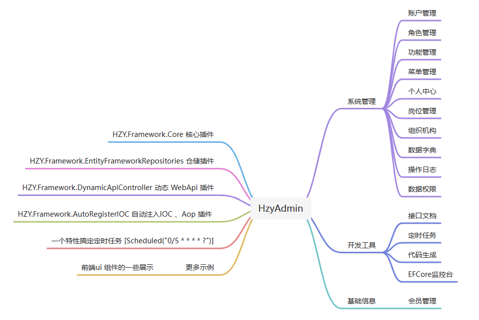
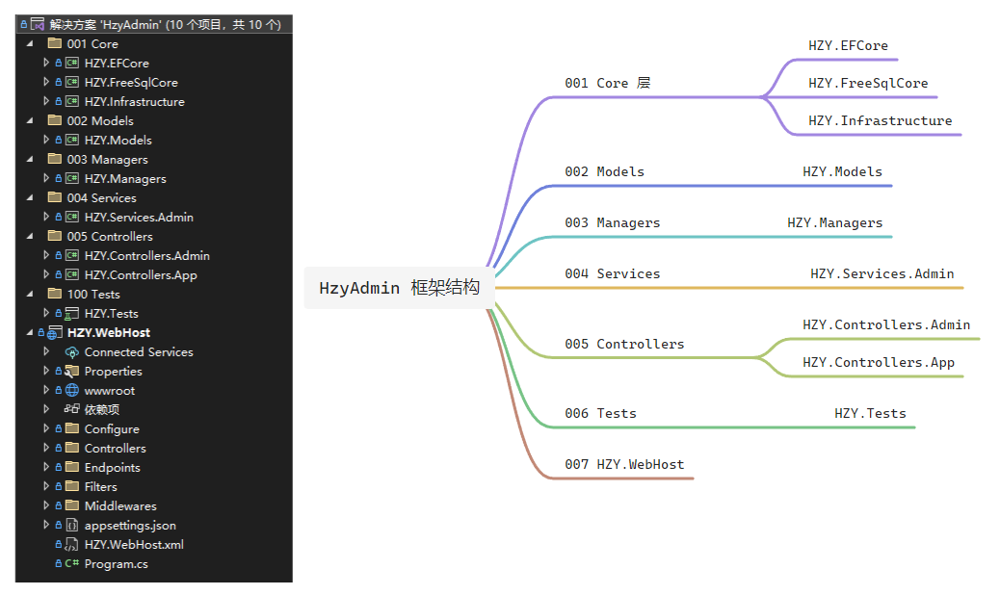
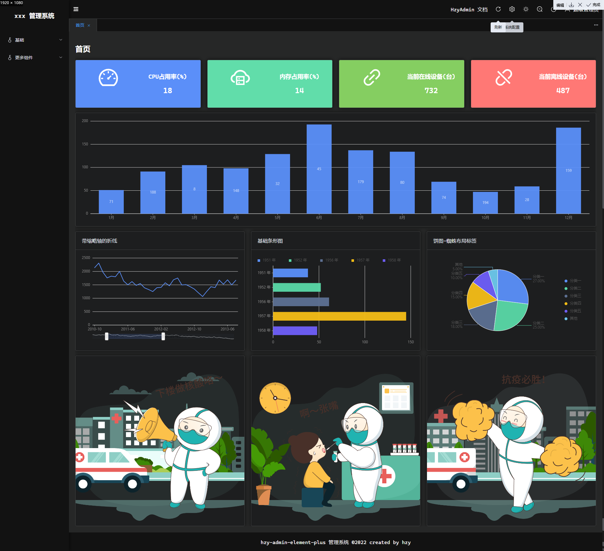

# HzyAdmin

### QQ交流群
    534584927（已满）、174311837

### 📝  介绍 
    前后分离,后台通配权限管理系统！

    数据库脚本位置根目录 doc 文件夹 目前仅提供了 MySql、SqlServer、PgSql 脚本 ，其他请使用efcore迁移（迁移教程请看语雀文档）

    后端技术：.Net6、EFCore6、Swagger 、Redis
    
    前端：Vue3.x 、Antd Of Vue 3.0 、Vite 、Pinia 2.0.x 、TypeScript
    
    开发需要环境：vs2022 、 .Net6.0 、VsCode 、Redis

### [演示地址](http://124.221.128.7:5600)

###   文档
[语雀文档 针对 Next 分支](https://www.yuque.com/u378909/yidf7v)

[bilibili视频介绍](https://www.bilibili.com/video/BV1tt4y157qH?vd_source=8803f9b05bd0271050a91c6e659a69d0#reply121926607792)

#### MVC版本
[https://gitee.com/hzy6/hzy-admin-mvc](https://gitee.com/hzy6/hzy-admin-mvc)

#### WebApi 任务调度平台
[https://gitee.com/hzy6/hzy-quartz](https://gitee.com/hzy6/hzy-quartz)

### 功能列表

### 目录结构

### ✨  部分截图

|  |  |
|-------------------------------------------|---|

|  |   |
|--------------------------------------|---|

|  |   |
|-----------------------------------|---|

|  |   |
|-----------------------------------|---|

|  |    |
|---------------------------------------|---|

|  |   |
|--------------------------------------|---|

|  |   |
|-----------------------------------|---|

 

 
