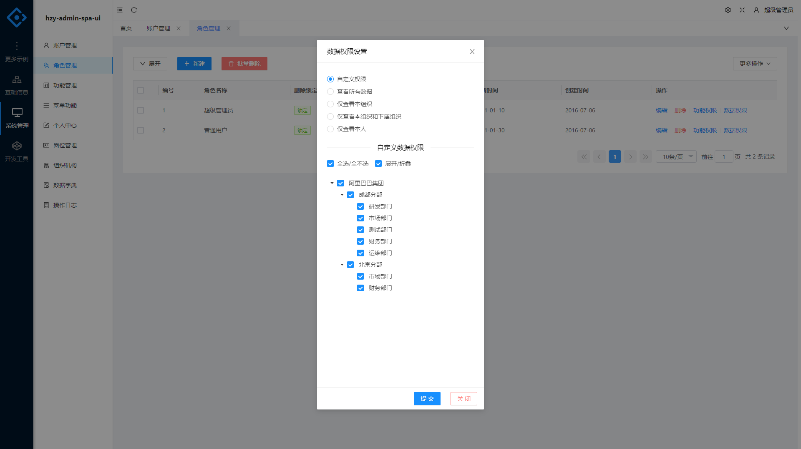
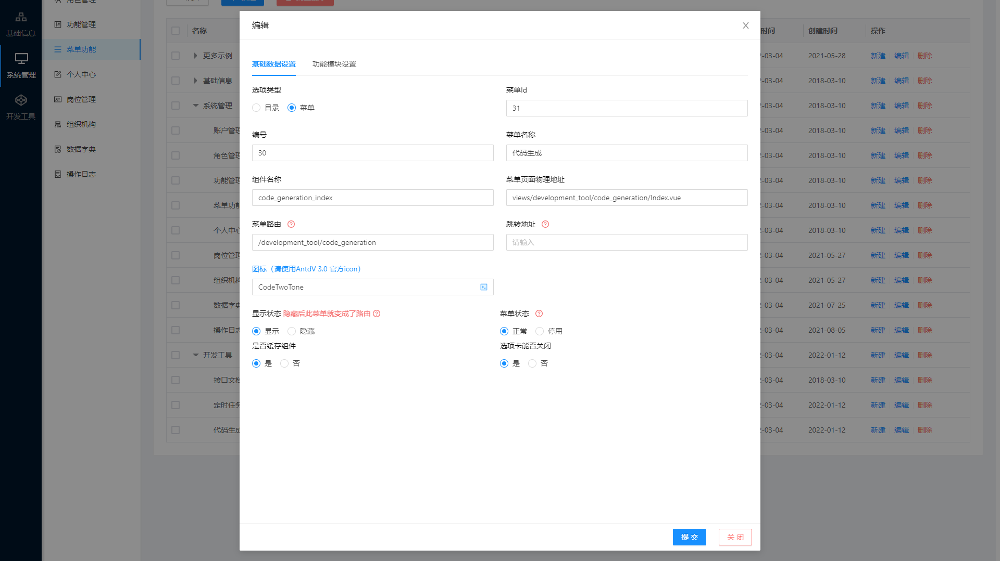
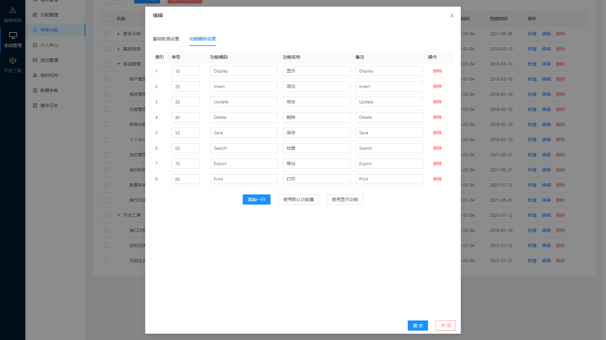
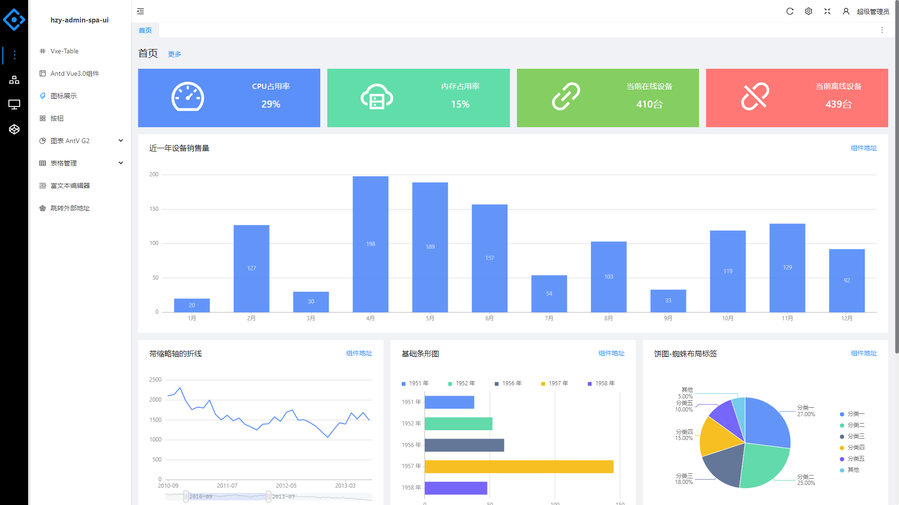
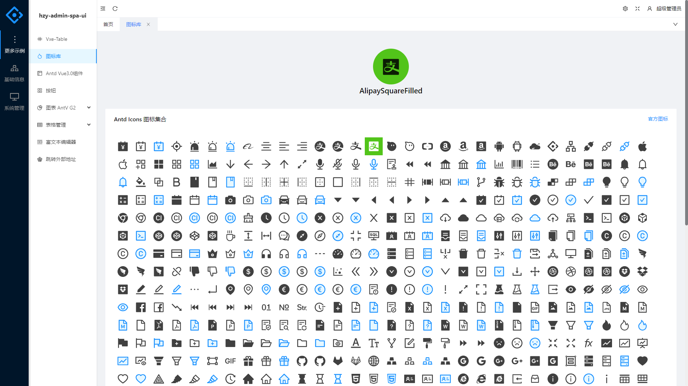
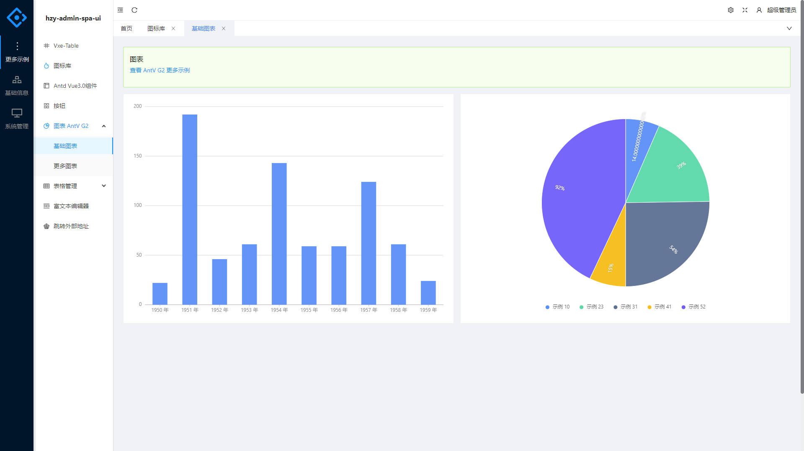
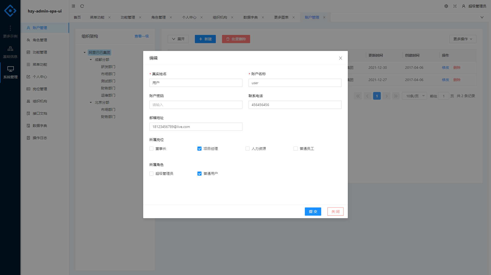
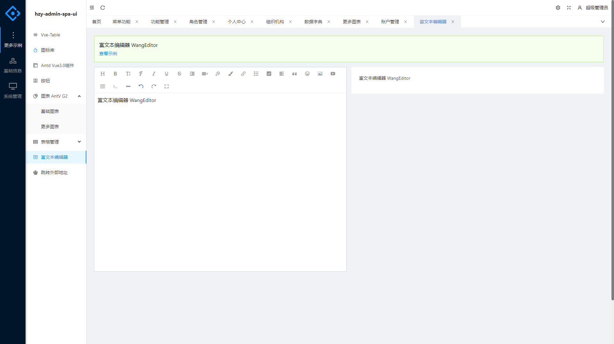
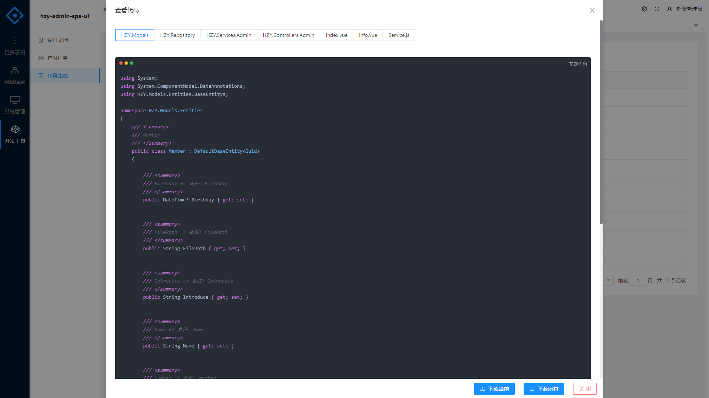
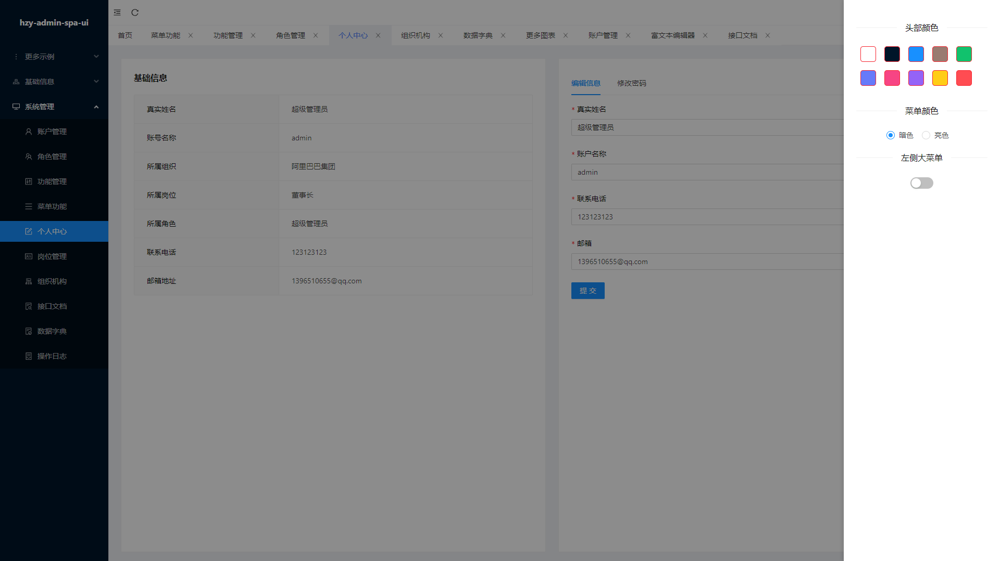

# HzyAdmin

#### MVC版本
[https://gitee.com/hzy6/hzy-admin-mvc](https://gitee.com/hzy6/hzy-admin-mvc)

####   文档
[语雀文档 针对 Next 分支](https://www.yuque.com/u378909/yidf7v)

#### WebApi 任务调度平台
[https://gitee.com/hzy6/hzy-quartz](https://gitee.com/hzy6/hzy-quartz)

#### QQ交流群
    534584927

#### 📝  介绍 
    前后分离,后台通配权限管理系统！

    数据库脚本位置根目录 doc 文件夹 目前仅提供了 MySql、SqlServer、PgSql 脚本

    后端技术：.Net6、EFCore6、Swagger 、Redis
    
    前端：Vue3.x 、Antd Of Vue 3.0 、Vite
    
    开发需要环境：vs2022 、 .Net6.0 、VsCode 、Redis

    框架基于 HzyEFCoreRepositories 数据访问 : https://gitee.com/hzy6/hzy-efcore-repositories

    IOC 、Aop : https://www.yuque.com/u378909/yidf7v/paak3i 
    

#### 功能列表

    系统管理            开发工具
        账户管理            接口文档
        角色管理            定时任务
        功能管理            代码生成
        菜单管理            EFCore监控台
        个人中心
        岗位管理
        组织机构
        数据字典
        操作日志
        数据权限

#### 目录结构

#### ✨  部分截图

|  |  |
|-------------------------------------------|---|

|  |   |
|--------------------------------------|---|

|  |   |
|-----------------------------------|---|

|  |   |
|-----------------------------------|---|

|  |    |
|---------------------------------------|---|

|  |   |
|--------------------------------------|---|

|  |   |
|-----------------------------------|---|

