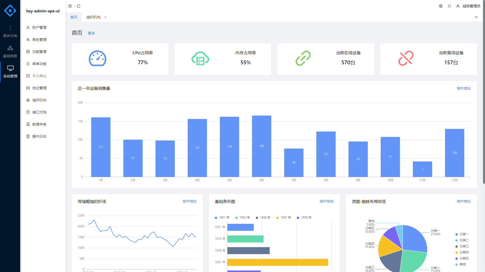
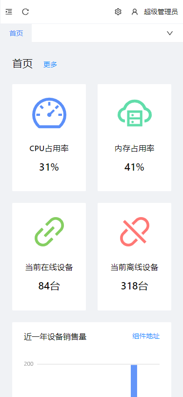

# hzy-antdv-admin

### 服务端 实现

Java:https://gitee.com/hzy6/hzy-admin-spa

Net5:https://gitee.com/hzy6/HzyAdminSpa

### 框架技术

```
Vue3.x | VueRouter | Pinia | Vite | Antd Vue3 | Vxe-Table4
```

## 1、安装插件包

```
npm install 或者 pnpm install 或者 yarn install
```

### 2、启动运行

```
npm dev 或者 pnpm dev 或者 yarn dev
```

### 3、打包项目

```
npm build 或者 pnpm build 或者 yarn build
```

### Lints and fixes files

```
npm run lint
```

### 自定义配置

查看 [Configuration Reference](https://cli.vuejs.org/config/).





